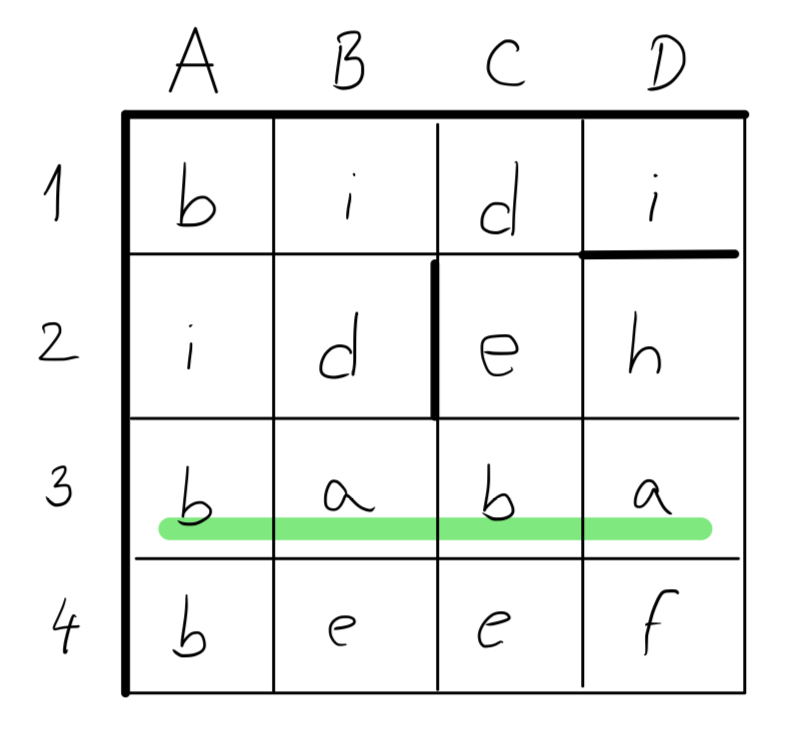

# Dokumentácia programu Krížovka

## Používateľská dokumentácia

Používateľ môže s programom interagovať pomocou predikátu `krizovka/5`. Rozoberieme si postupne každý zo vstupných argumentov. 

### Slovnik
Argument Slovnik je list slov a nápovied, z ktorých chceme aby sa skladala naša krížovka. Slovník môže vyzerať napríklad takto:

```prolog
[[auto, 'Dopravný prostriedok so 4 kolesami'], [dom, 'Objekt v ktorom bývame']...]
```
Je to teda list dvojíc, kde každá dvojica pozostáva zo slova, ktoré vložíme do tajničky a nápovedy na dané slovo.

### Tajenka
Tajenka je jedno slovo, ktoré bude výsledkom našej krížovky. Tajenka sa umiestňuje vždy do stredu krížovky a musí mať presne takú dĺžku, aký dlhý je rozmer, v ktorom ju umiestňujeme.

### TajenkaSmer
TajenkaSmer určuje smer, v ktorom bude tajenka do krížovky umiestnená. Môžu to byť hodnoty `doprava` alebo `dole`. 

`doprava` znamená, že tajenka bude umiestnená v strednom riadku zľava doprava.

`dole` znamená, že tajenka bude umiestnená  v strednom stĺpci zhora nadol.

Opäť treba pripomenúť, že je veľmi dôležité, aby sa zhodovala šírka krížovky s dĺžkou tajenky, v prípade, že smer je nastavený na `doprava` a opačne, ak je nastavený smer `dole`, tak sa musí zhodovať výška krížovky a dĺžka tajenky.

### VyskaKrizovky
VyskaKrizovky je číslo, ktoré reprezentuje výšku vytvorenej krížovky.

### SirkaKrizovky
SirkaKrizovky je číslo, ktoré reprezentuje šírku vytvorenej krížovky.

### Príklad vstupu

Ako príklad vstupu si môžeme predstaviť napríklad tento vstup:

```prolog
slovnik(X), krizovka(X, baba, doprava, 4, 4).
```

Ak krížovka existuje, tak predikát vráti nasledujúci výstup (vždy vráti iba prvú nájdenú krížovku):

```
  A B C D 
1 * * * * 
2 * * * * 
3 * * * * 
4 * * * * 


Tajenka sa nachádza v riadku číslo 3

Nápovedy v smere doprava:
--------------------
Nápoveda 1A, dĺžka slova je 4: Hľadané slovo je "bidi"
Nápoveda 2C, dĺžka slova je 2: Hľadané slovo je "eh"
Nápoveda 2A, dĺžka slova je 2: Hľadané slovo je "id"
Nápoveda 4A, dĺžka slova je 4: Hľadané slovo je "beef"

Nápovedy v smere dole:
--------------------
Nápoveda 1A, dĺžka slova je 4: Hľadané slovo je "bibb"
Nápoveda 1B, dĺžka slova je 4: Hľadané slovo je "idae"
Nápoveda 1C, dĺžka slova je 4: Hľadané slovo je "debe"
Nápoveda 1D, dĺžka slova je 1: Hľadané slovo je "i"
Nápoveda 2D, dĺžka slova je 3: Hľadané slovo je "haf"
```

Výstup obsahuje:

#### Krížovku:

```
  A B C D 
1 * * * * 
2 * * * * 
3 * * * * 
4 * * * * 
```
Krížovka je reprezentovaná znakmi `*`. Ku každému riadku je priradené číslo od 1 a ku každému stĺpcu je priradené písmeno od A...

#### Miesto kde sa nachádza tajenka:

```
Tajenka sa nachádza v riadku číslo 3
```
Výstup ďalej obsahuje výpis, ktorý hovorí, kde sa nachádza tajenka. Môže to byť buď číslo riadku, alebo písmeno stĺpca na základe toho, či si používateľ zvolil ako smer tajenky `doprava` alebo `dole`.

#### Nápovedy:
```
Nápovedy v smere doprava:
--------------------
Nápoveda 1A, dĺžka slova je 4: Hľadané slovo je "bidi"
Nápoveda 2C, dĺžka slova je 2: Hľadané slovo je "eh"
Nápoveda 2A, dĺžka slova je 2: Hľadané slovo je "id"
Nápoveda 4A, dĺžka slova je 4: Hľadané slovo je "beef"

Nápovedy v smere dole:
--------------------
Nápoveda 1A, dĺžka slova je 4: Hľadané slovo je "bibb"
Nápoveda 1B, dĺžka slova je 4: Hľadané slovo je "idae"
Nápoveda 1C, dĺžka slova je 4: Hľadané slovo je "debe"
Nápoveda 1D, dĺžka slova je 1: Hľadané slovo je "i"
Nápoveda 2D, dĺžka slova je 3: Hľadané slovo je "haf"
```
Na záver výstup obsahuje výpis všetkých nápovied ku slovám v tajničke. Nápovedy sú rozdelené na nápovedy slov v smere `doprava` a na nápovedy slov v smere `dole`. 

Jedna nápoveda obsahuje informáciu, kde slovo začína vo forme: číslo riadku a písmeno stĺpca. To znamená, že napríklad 2D by znamenalo, že slovo začína v okienku v riadku 2 a v stĺpci D. 

Ďalej nápoveda obsahuje informáciu o dĺžke slova, ktoré treba do krížovky doplniť. 

Nakoniec jeden riadok nápovedy obsahuje nápovedu ku slovu, ktorá bola zadaná používateľom v slovníku. 

Ukážme si aj, ako by vyzerala takto vyplnená tajnička:


*Poznámka:* V tomto príklade, ale aj vo všetkých ostantých vzorových vstupoch, nápovedy slúžia iba na prevedenie funkcionality, preto nápovedy priamo hovoria, čo je naše hľadané slovo. V reálnom prípade sme tam zadali skutočnú nápovedu.

Príklady použiteľný vstupov môžete nájsť [tu](vstupy.txt).

## Programátrská dokumentácia

Hlavným predikátom celého programu je predikát `krizovka/5`, ktorý vyzerá takto:

```prolog
krizovka(Slovnik, Tajenka, TajenkaSmer, VyskaKrizovky, SirkaKrizovky) :- 
    najdi_krizovku(Slovnik, Tajenka, TajenkaSmer, VyskaKrizovky, SirkaKrizovky, PouziteSlova),
    vypis_plochu(VyskaKrizovky, SirkaKrizovky),
    nl, nl,
    vypis_poziciu_tajenky(VyskaKrizovky, SirkaKrizovky, TajenkaSmer),
    nl, nl,
    vypis_napovedy(PouziteSlova, SirkaKrizovky),
    !.
```

Popíšeme si jednotlivé časti tohto predikátu a začneme s predikátom `najdi_krizovku/6`.

### najdi_krizovku/6

Tento predikát vyzerá nasledovne:

```prolog
najdi_krizovku(Slovnik, Tajenka, TajenkaSmer, VyskaKrizovky, SirkaKrizovky, PouziteSlova) :-

    vytvor_plochu(VyskaKrizovky, SirkaKrizovky, Plocha),

    vrat_okienko_tajenky(VyskaKrizovky, SirkaKrizovky, TajenkaSmer, OkienkoTajenky),
    
    prirad_tajenku(Tajenka, TajenkaSmer, OkienkoTajenky, VyskaKrizovky, SirkaKrizovky, Plocha, PlochaSTajenkou),

    vytvor_pozicie(VyskaKrizovky, SirkaKrizovky, OkienkoTajenky, Pozicie),

    prirad_slova(Slovnik, [], Pozicie, VyskaKrizovky, SirkaKrizovky, PlochaSTajenkou, PouziteSlova).
```

V prvom rade predikát vytvorí plochu krížovky pomocou predikátu `vytvor_plochu/3`. Plocha je asociačný list, ktorý je číslovaný od 0 do (VyskaKrizovky * SirkaKrizovky - 1). Táto plocha sa potom mapuje na okienka krížovky začínajúc okienkom vľavo hore. Ak by sme teda vytvorili plochu s výškou 3 a šírkou 4, tak by sa čísla priradili okienkam takto:

```
    A B C  D 
1 | 0 1 2  3 
2 | 4 5 6  7 
3 | 8 9 10 11
```

Následne predikát zistí okienko tajenky na základe smeru, ktorý zadal používateľ pomocou predikátu `vrat_okienko_tajenky/4`. OkienkoTajenky bude predstavovať číslo okienka, kde tajenka začína. Ak si používateľ zvolil, že chce tajenku miestniť smerom `dole`, tak sa tajenka umiestni do prostredného stĺpca, ale ak sa si užívateľ zvolil smer `doprava`, tak sa tajenka vloží do prostredného riadku. 

Vkládanie má ďalej na starosti predikát `prirad_tajenku/7`, ktorý do asociačného listu zapíše písmena tajenky. 

Následne si vygenerujeme pozície, kde chceme vkládať slová. O to sa stará predikát `vytvor_pozicie/4`. Vygenerujú sa pozície smerom `dole` ale aj smerom `doprava`. Tieto pozície sa vygenerujú po ľavom a hornom okraji krížovky. Napríklad pre krížovkou s výškou 3, šírkou 2 a miestom, kde je začiatok tajenky je druhý riadok by sa vygenerovali tieto pozície:

```prolog
[0-dole, 1-dole, 0-doprava, 4-doprava]
```
pretože takto by vyzerala krížovka:
```
    A B
1 | 0 1
2 | 2 3
3 | 4 5
```

Nakoniec už iba predikát `prirad_slova/7` sa pokúsi priradiť slová zo slovníka od krížovky. Ukážeme si ako funguje priradzovanie slov do krížovky:

### Priradzovanie slov do krížovky:

Na priradzovanie slov do krížovky existujú priradzovacie predikáty a to konkrétne:

`prirad_pismena/6` : Priradí do krížovky písmena do daných okienok, ktoré dostane ako argument. Písmenká priradí iba v prípade, že je dané okienko prázdne alebo, ak sa tam nachádza rovnaké písmenko. V opačnom prípade vracia `false` a slovo sa na dané miesto priradiť nedá.

`prirad_slovo/10` : Priradí slovo do krížovky zavolaním predikátu `prirad_pismena/6`. Tento predikát ale ešte predtým zistí okienka, kde sa dané slovo má nachádzať na základe začiatočného okienka a smeru slova. Okienka zistí pomocou predikátu `vrat_cisla_okienok_pre_slovo/6`.

`prirad_slova/7` : Prechádza slová zo slovníku a priradzuje ich do krížovky pomocou predikátu `prirad_slovo/10`. V prípade, že priradí slovo do krížovky, ktoré nedosahuje až na koniec plochy, tak vytvorí aj novú pozíciu, ktorú pridá medzi zvyšné pozície. Táto nová pozícia pokračuje v rovnakom smere a začína v okienku za položeným slovom.


### Vypisovacie predikáty:

Po nájdení krížovky predikát `krizovka/5` už iba vypíše výsledok pomocou nasledujúcich predikátov:

`vypis_plochu/2` : Tento predikát vypíše plochu pomocou znaku `*`. Rovnako označí riadky číslami od 1 a stĺpce písmenami od A.

`vypis_poziciu_tajenky/3` : Tento predikát vypíše jednu vetu ohľadom toho, kde sa tajenka nachádza. Vypíše buď číslo riadku alebo písmeno stĺpca.

`vypis_napovedy/2` : Posledný predikát vypíše nápovedy na použité slová v krížovke. Predikát vypíše najprv nápovedy v smere `doprava` a následne v smere `dole`. Každá nápoveda je onzačená číslom riadku, písmenom stĺpca, dĺžkou slova a potom samotnou nápovedou.

### Záver

Toto je popísaná hlavná funkcionalita programu **Krížovka**. Všetky spomenuté predikáty, ako aj iné pomocné prediáty, sú dôkladne okomentované v [zdrojovom kóde](krizovka.pl). 